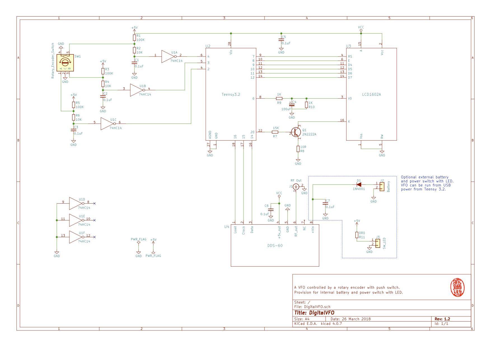
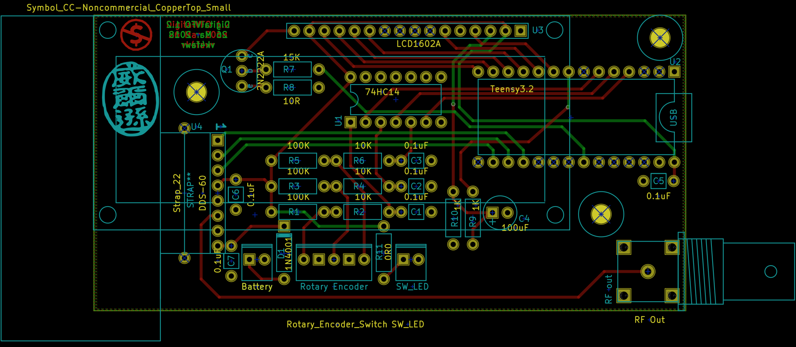

Digital VFO
===========

Status
======

Version 1.4 is running!  There is provision for a battery plus monitoring
of the voltage.  I will get this running, but there will be another version
called "HeadlessVFO" that will be controlled only by a PC via USB.  This
version won't need a display or rotary encoder, plus it'll always be
connected to a PC and get USB power, so no battery.  I probably don't need
a Teensy 3.2 to drive HeadlessVFO, so I'm searching for cheap microcontrollers
on AliExpress that can accept text commands from the USB connection.

Version 1.4
===========

21 June Update
--------------

The case is finished.  When/if a permanent battery is installed I'll drill
a few holes for a switch and a 9v charging port.  The software for commands
from the PC is basically finished.  I removed a lot of stuff not necessary
for using the DigitalVFO in an instrument cluster.

19 May Update
-------------

The 1.4 board is back from Seeed, built and operating.  This version has
provision for the micro to sense the battery voltage so it can display
a battery symbol with full/empty options.
Software development time!

Version 1.3
===========

A redesign to use another BNC connecter as the first was junk.
Not sent to Seeed as I also decided to add battery monitoring.

Version 1.2
===========

After building the v1.1 PCB and paddling around on aliexpress.com to find
different components, I'm starting on the v1.2 PCB.  Should be smaller, have
the LCD located in a more natural place and place controls in more natural 
positions.  May also rethink the power supply - perhaps run both board and
DDS-60 from a 78L05 instead of running 9v to DDS-60 and using the onboard
regulator to generate 5v for the main board.  Use the same case as before.

29 March Update
---------------

Version 1.2 of the PCB submitted to Seeed today.  Changes were:

* moved components around to minimize vias
* on-board BNC socket, saves on internal cables
* moves Teensy to edge so USB goes through case, saves on internal cables
* added provision for internal 2s Li-Ion battery and manager PCB feeding the DDS-60
* added provision for LED power in battery power switch

Version 1.1
===========

Need to:

* new case allows in-case programming
* new case has ventilation (passive at first)
* better packaging (printed circuit board)
* better, more linear, contrast control

And, of course:

* allow control over USB
* maybe add a "sweep" function to the in-case code (from, to, step, pause)
* look for bugs in the software

With PC control we can measure things with a "sweep" function.  Allow the PC to
control the VFO frequency and the PC can sweep the frequency to whatever limits
required.  At the same time, measure voltage/current/whatever from other Teensy
instruments.  This means we could build:

* an antenna analyzer
* measure filter response curves
* etc

This version will use a printed circuit board to address the general
unreliability of the 1.0 version.  The LCD will plug into the back of the main
PCB and the DDS-60 will plug into the front.  The rotary encoder will have a
cable with header that will plug into the PCB.

The file **DigitalVFO_Schematic_1.1.pdf** is the schematic of the circuit.  The
directory **kicad/DigitalVFO/Gerbers** holds the output files produced by KiCad.
The Gerber files were sent to a Chinese PCB fab factory.

The PCB has now returned from China, and it does look good.  Better yet,
assembling the board and testing it shows the thing WORKS!  I had to change the
code to match changes I made while setting out the PCB, BUT IT WORKS!!

Version 1.0
===========

The VFO hardware is complete.  Everything is inside a small metal case.  Perhaps
too small a metal case as running at 12v the thing overheats and becomes
unreliable.  It seems OK at 9v.  I also didn't think about accessing the Teensy
USB port when the case is closed, so I can't tweak the software without cracking
the case, which I can't do often as the wiring inside is fragile.

Completed:

* Interface display to teensy, test writing, etc
* Interface rotary encoder, get rotate and button press events
* Basic display of 8-digit frequency
* Implement a simple 'event' system to produce system events
* Get frequency column select and increment/decrement working
* Save state in the EEPROM, restore state on start up
* implement a simple menu system 
* extend the menu system to allow extra functionality
* added vfo_DClick double-click event
* add code to toggle standby/ON mode (from vfo_DClick)
* add in the DDS-60 control code
* add a "Calibrate" setting to adjust the divider value in the DDS-60 code
* test the thing fully!
* make up a metal case and rebuild into it

Perhaps:

* make another case with USB access
* think about making a circuit board for it (Fritzing, cheap Chinese PCB maker?)

Ongoing:

* look for bugs in the software
* maybe add a "sweep" function to the code (from, to, step, pause)
* split out the Arduino code samples showing RE handling and menu system
* think about hardware assembly methods to make DigitalVFO version 2!

About
=====

I'm an amateur radio operator, but since I'm not in the country in which I
earned my licence I can't actually build or operate a transmitter, so I build
receivers and test gear.  I'm working on being able to operate from my
country of residence, but that's another story.

One piece of test gear that would be useful is called a Signal Generator.  This
is a piece of kit that generates a radio signal of a known frequency.  It can
also be used as a VFO (variable frequency oscillator) in a receiver.

The modern way to accurately generate an RF signal is to use the AD9851 DDS chip
which digitally generates a known frequency from a crystal source.  There are 
quite a few people offering small boards using this chip but I like the
`DDS-60 daughterboard <http://midnightdesignsolutions.com/dds60/>`_
from `Midnight Design Solutions <http://midnightdesignsolutions.com/>`_.
All I need to do is use a microcontroller to control the DDS-60 with some
sort of frequency display!

The obvious solution is to use an Arduino and the ubiquitous 16x2 display.
Since the Arduino is a little large and I hoped to put the kit into a small
case I decided to use a
`Teensy microcontroller <https://www.pjrc.com/store/teensy32.html>`_
which is programmable through the Arduino IDE.  It's about 35mm x 18mm!

I got a couple of generic 16x2 displays from
`AliExpress <https://www.aliexpress.com/wholesale?catId=0&initiative_id=SB_20170504210259&SearchText=display+1602>`_.
I got the rotary encoder from
`the same place <https://www.aliexpress.com/wholesale?catId=0&initiative_id=AS_20170504210300&SearchText=rotary+encoder+switch>`_.

Schematic
=========

The latest code runs on this hardware arrangement:

PCB
=========

The 1.2 PCB looks like this:

Interface
=========

I don't need a lot of functionality in this VFO, I just want to:

* set a frequency from 1.000000Mz to 30.000000MHz with steps down to 1Hz
* save and restore a number of frequencies

It should be possible to do all this with an interface made up of:

* A 16x2 display, and
* A rotary encoder, with switch.

Using the above the user can move a 'column selection' indication in the
frequency display by pressing down on the encoder knob and then rotating it.
With the knob up, rotation just increments or decrements the
selected digit with over- and under-flow occurring to the left of the
selected digit.  This is pretty much the way everybody does it.

It would also be nice if the VFO remembered the frequency and selected digit if
the power is lost and then restored.  Use the on-board EEPROM for this, as well
as remembered frequencies.

We may have to come up with some way of having a simple menu-driven method
of:

* Saving/restoring frequencies
* Adjusting various internal parameters such as clock scaling, etc.

We could possibly drop into the menu system if the encoder knob is held down
for some length of time.
